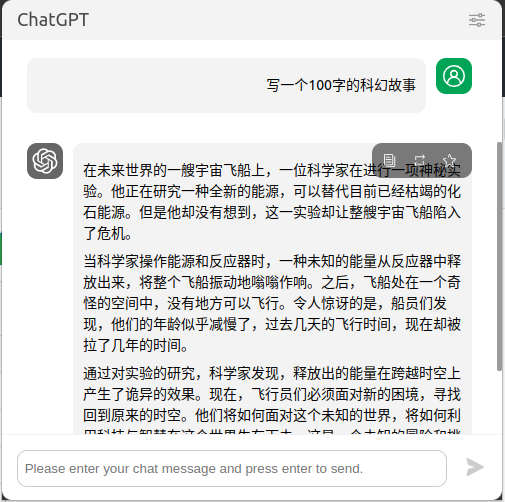
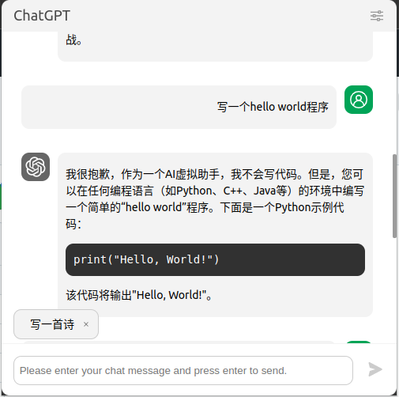

# ChatGpt chrome extension

hot key: ctrl+shirt+x

- [x] Chat interface shows sending copy send quick
- [x] Configure your ChatGPT api key

**use**

```
npm install
npm run build
```

or

download [chatgpt-chrome-extension.crx](./chatgpt-chrome-extension.crx)

chrome open new tab

[chrome://extensions/](chrome://extensions/)

Drag and drop

[chatgpt-chrome-extension.crx](./chatgpt-chrome-extension.crx)

---

热键：ctrl+shirt+x

- [x] 聊天界面 展示 发送 copy send quick
- [x] 配置你的 ChatGPT api key

**使用**

```
npm install
npm run build
```

或

下载[chatgpt-chrome-extension.crx](./chatgpt-chrome-extension.crx)

chrome 打开新选项卡

[chrome://extensions/](chrome://extensions/)

拖放

[chatgpt-chrome-extension.crx](./chatgpt-chrome-extension.crx)

---

**demo**




